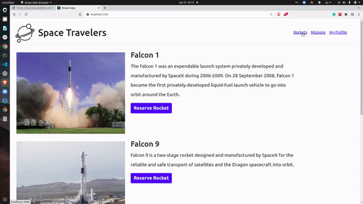

# Title-Info
> Space Traveler's Hub is a web application which shows the information of space missions and rockets and give option to select rocket and join in a mission.

# GIF/Screenshot

## Built With
- React
- Redux
- Bootstrap
- Netlify

## Live Demo
For the link to the live demo, [Click here](https://celadon-churros-f5ad84.netlify.app/)

## Getting Started
To get a local copy up and running you just need to follow the following steps;
- Clone this repository with
git clone `https://github.com/Tufahel/space-travelers-hub.git` using your terminal or command line.
- run code `.` to open it in vscode.
- run `npm install` in terminal.
- run `npm run build`.
- run `npm start`.

## Authors

👤 **Author1: Tobin Chilongo Jnr**

- GitHub: [@Tobinchilongo](https://github.com/Tobinchilongo)
- Twitter: [@Tobin_Official](https://twitter.com/tobinchilongo)
- LinkedIn: [@Tobin Chilongo](https://www.linkedin.com/in/tobin-chilongo-a6736415a/)

👤 **Author2: Tufahel Ahmed**

- GitHub: [@Tufahel](https://github.com/Tufahel)
- Twitter: [@TufahelAhmed](https://twitter.com/TufahelAhmed)
- LinkedIn: [@Tufahel-Ahmed](https://www.linkedin.com/in/tufahel-ahmed/)

## 🤝 Contributing

Contributions, issues, and feature requests are welcome!

Feel free to check the [issues page](../../issues/).

## Show your support

Give a ⭐️ if you like this project!

## Acknowledgments

- Microverse

## 📝 License

This project is [MIT](./MIT.md) licensed.
